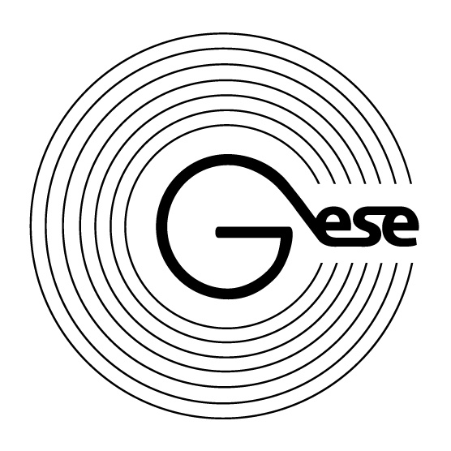

# Gese 2.0

## Roadmap
1. 2017 Research on Blockchain Technology and its application to solve the problem of counterfit problem in alcohol industry
2. MAR 2018 Gese 1.0 | Blockchain Launched
3. SEP 2018 Gese 1.0 pivots to Gese 2.0 
4. OCT 2018 Gese 2.0 | Private Sale Launch
5. NOV 2018 Gese 2.0 | Starting pilot tests with alcohol manufacturers
6. NOV 2018 Asian Autumn 2018 Roadshow Comming soon...
7. DEC 2018 Gese 2.0 | Blockchain Main Net Launch
8. DEC 2018 India Winter 2018 Roadshow
9. Q1 2019 KPI Q1 - 250K NFC
10. APR 2019 Gese 2.0 | Private Sale End
11. MAY 2019 Gese 2.0 tokens are listed on crypto exchange
12. Q2 KPI Q2 - 1M NFC
Please follow us for updates

## Terms of Sale
* SYMBOL (ERC20 STANDART)
* GESE Tokens are released on Ethereum blockchain and use highly popular token standard.
* TICKER GSE
* The symbol used to identify digital asset 
* SUPPLY / EMISSION 100 000 000 GSE The emission is limited. No more Gese tokens will be released.
* TOKEN SALE (50%) 50 000 000 GSE The batch to be sold in the current sale. No more than 50% are offered at this stage.
* HARD CAP $15 000 000 The maximum amount of investment to be raised at this stage
* SOFT CAP $1 000 000 The minimum amount of investment to be raised at this stage
